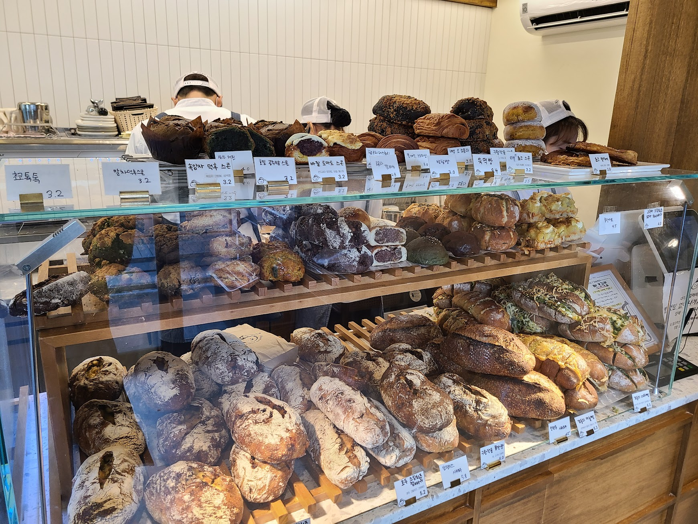

## 문제 1

Q: 다음 이미지에 대한 설명 중 옳지 않은 것은 무엇인가요?
- (1) 카페 내부가 깔끔하고 현대적인 디자인으로 꾸며져 있습니다.
- (2) 벽면이 노란색으로 칠해져 있습니다.
- (3) 모든 의자가 흰색입니다.
- (4) 사람들이 바에서 음료를 주문하고 있습니다.

Listening: Which of the following descriptions of the image is incorrect?
- (1) The interior of the cafe is neat and modern in design.
- (2) The wall is painted yellow.
- (3) All the chairs are white.
- (4) People are ordering drinks at the bar.

정답: (3) 모든 의자가 흰색이 아니라 갈색과 흰색이 섞여 있습니다.

---------------------

## 문제 2

Q: 다음 이미지에 대한 설명 중 옳지 않은 것은 무엇인가요?
- (1) 다양한 종류의 빵이 진열되어 있습니다.
- (2) 빵 가격이 모두 동일하게 표시되어 있습니다.
- (3) 투명한 진열대 안에 빵이 있습니다.
- (4) 직원들이 모자를 착용하고 있습니다.

Listening: Which of the following descriptions of the image is incorrect?
- (1) Various types of bread are displayed.
- (2) The prices of the bread are all the same.
- (3) The bread is inside a transparent display case.
- (4) The staff are wearing hats.

정답: (2) 빵 가격은 모두 동일하지 않습니다.

---------------------

## 문제 3

Q: 다음 이미지에 대한 설명 중 옳지 않은 것은 무엇인가요?
- (1) 사람들은 테이블에 앉아 대화를 나누고 있습니다.
- (2) 바닥은 나무로 되어 있습니다.
- (3) 벽에는 창문이 많이 있습니다.
- (4) 방 안에는 사람들이 모두 서 있습니다.

Listening: Which of the following descriptions of the image is incorrect?
- (1) People are sitting at tables having conversations.
- (2) The floor is made of wood.
- (3) There are many windows on the wall.
- (4) Everyone in the room is standing.

정답: (4) 방 안에는 사람들이 대부분 앉아 있습니다.

---------------------

